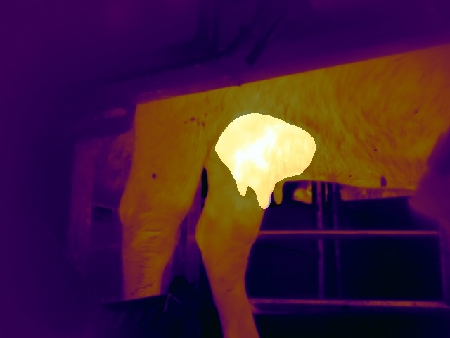

# Thermal Udder Segmentation for Mastitis Prediction

This repository presents a comprehensive approach to thermal segmentation for mastitis prediction in buffaloes, emphasizing resilient learning on the edge from incomplete or noisy data. The segmentation task focuses on identifying the udder region within thermal images, which is crucial for accurate mastitis assessment. The implemented solution integrates several key strategies to enhance segmentation performance and robustness.

## Key Features

1. **Segmentation Mask Smoothing:**
   - The provided polygonal masks are smoothed using Gaussian blurring to account for the inherent imprecision in the boundary definition of the udder region.

2. **Joint Dice Loss Function:**
   - The segmentation task employs a joint Dice loss function, optimizing the model's performance by considering the spatial overlap between predicted and ground truth masks.

3. **Self-Supervised Autoencoder:**
   - A self-supervised learning stage is implemented using an autoencoder. The autoencoder learns to reconstruct the thermal images, serving as a pretext task to leverage unlabeled data effectively.

4. **Transfer Learning:**
   - Transfer learning is applied after the self-supervised autoencoder stage, leveraging knowledge gained from a related domain to fine-tune the segmentation model on the target thermal images.

## Buffalo Milkings Dataset

The repository includes a dataset (`buffalo_data`) containing processed images of udder regions and associated data on the evolution of maximum temperatures during milking.

1. **Dataset Structure:**
   - The dataset comprises thermal images of buffalo udders that have been segmented using the neural network model. For each buffalo ID and unique milking session, the maximum temperatures extracted from the segmented udder regions are recorded.
   - The dataset includes plots showing the evolution of maximum temperatures throughout each milking session. Temperatures identified as outliers for the current milking are removed according to the Interquartile Range (IQR) method, facilitating cleaner and more accurate temporal analysis and tracking of individual buffaloes.

2. **Example Prediction Image:**
   

## Project Structure

1. **Training:**
   - Execute the training notebook (`training.ipynb`), adjusting hyperparameters as needed.

2. **Testing:**
   - Execute the testing notebook (`testing.ipynb`) to evaluate the trained model on test data.
